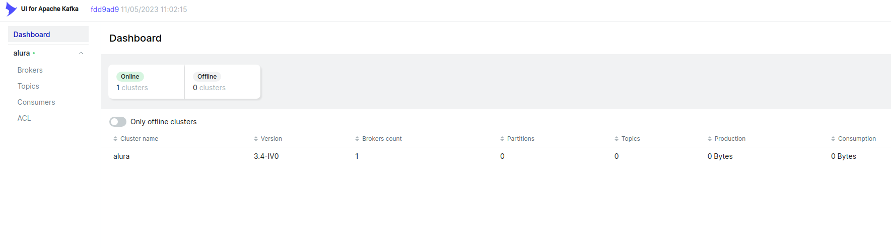
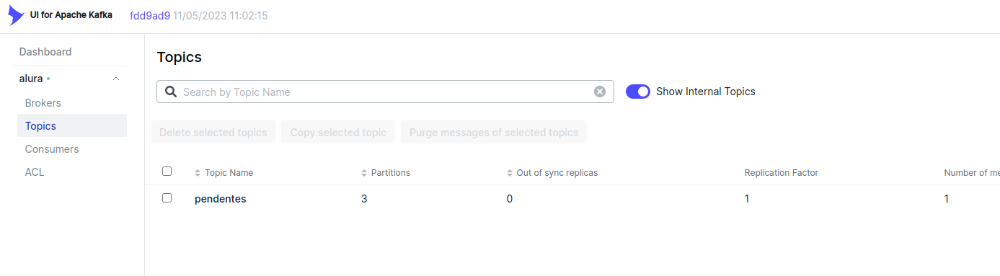
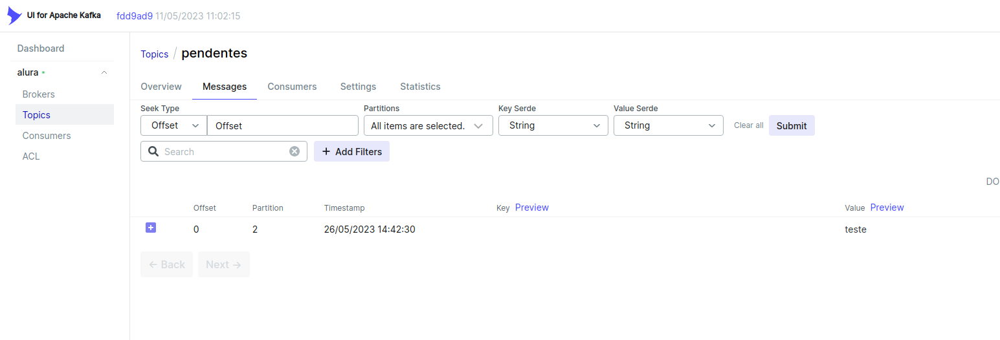

# Demo Spring kafka


Este é apenas um hello world de um microserviço  
que irá produzir uma mensagem no kafka


## Dependencias
* docker e docker-compose

## How to ?

### Como roda o projeto ?
* ```docker-compose up```

### Como enviar a mensagem para o kafka ?
* HTTP GET http://localhost:8081/

## Como verificar se a mensagem foi recebida ?
* Acessar o kafka-ui http://localhost:8080/




* Acessar o topico ```pendentes```




* Acessar a aba Messages


