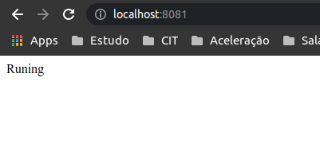
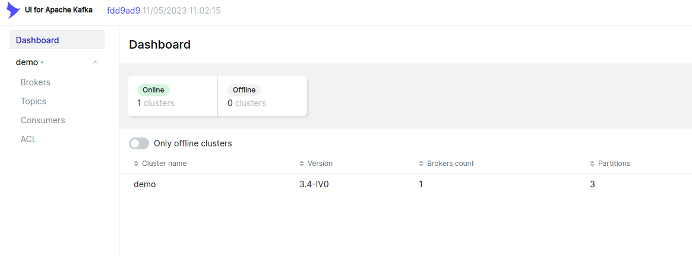
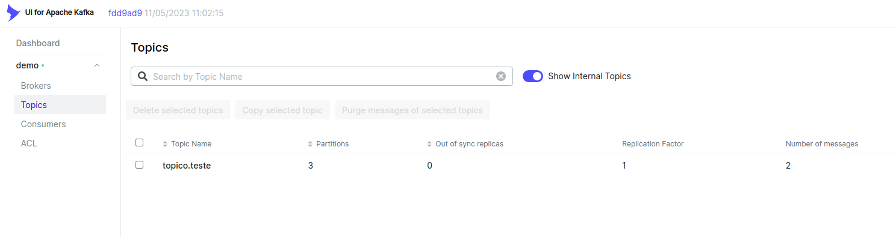
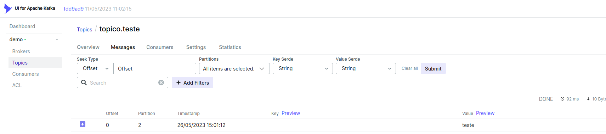

# Demo Spring kafka


Este é apenas um hello world de um microserviço  
que irá produzir uma mensagem no kafka


## Dependencias
* docker e docker-compose

## Observação

* O topico esta configurado nas variaveis de ambiente no docker-compose
```yaml
services:
  app:
    container_name: app
    build: .
    depends_on:
      - kafka
      - zookeeper
    ports:
      - "8081:8081"
      - "8000:8000"
    environment:
      SERVER_PORT: 8081
      KAFA_HOST: kafka:9092
      KAFKA_TOPICO: topico.teste   <----------
```

* Para recuperar o nome do tópico:

```java
@Autowired
private Environment env;

String topico = Objects.requireNonNull(env.getProperty("KAFKA_TOPICO"));
```

## How to ?

### Como roda o projeto ?
* ```docker-compose up```

### Como enviar a mensagem para o kafka ?
* HTTP GET http://localhost:8081/



## Como verificar se a mensagem foi recebida ?
* Acessar o kafka-ui http://localhost:8080/




* Acessar o topico ```topico.teste```




* Acessar a aba Messages


